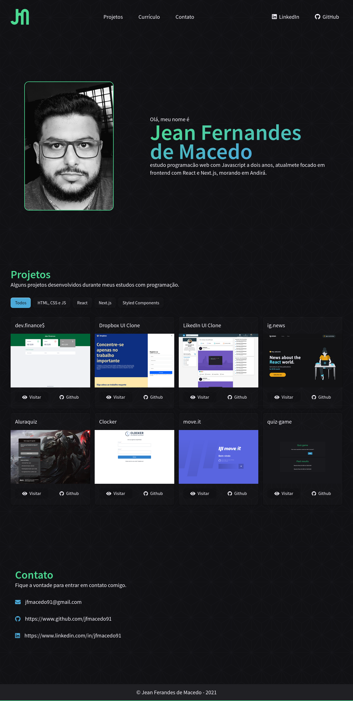
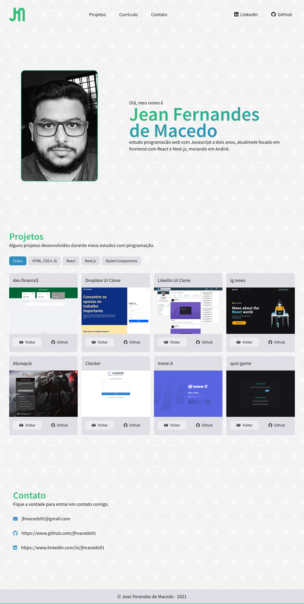

<h1 align="center">
	
</h1>

	
	
  

## Sobre

Esse projeto foi desenvolvido com o intuito de mostrar um pouco do que eu já fiz como desenvolvedor web, as cores do dark mode e light mode são aplicadas de acordo com as preferencias de tema do usuário, para ver o deploy do projeto é só [clicar aqui!](https://upbeat-elion-85001a.netlify.app)

	
	

## Tecnologias utilizadas

O projeto foi desenvolvido utilizando as seguintes tecnologias

- [HTML5](https://developer.mozilla.org/pt-BR/docs/Web/HTML)
- [CSS3](https://developer.mozilla.org/pt-BR/docs/Web/CSS)
- [Javascript](https://developer.mozilla.org/pt-BR/docs/Web/JavaScript)

Desenvolvido por:

 
